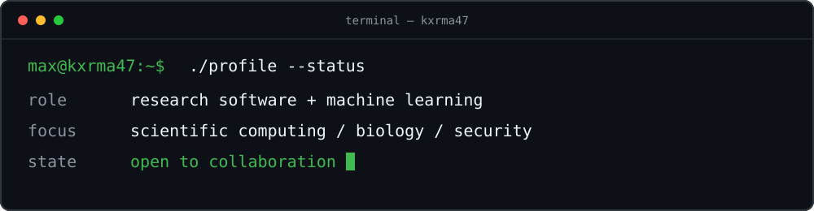
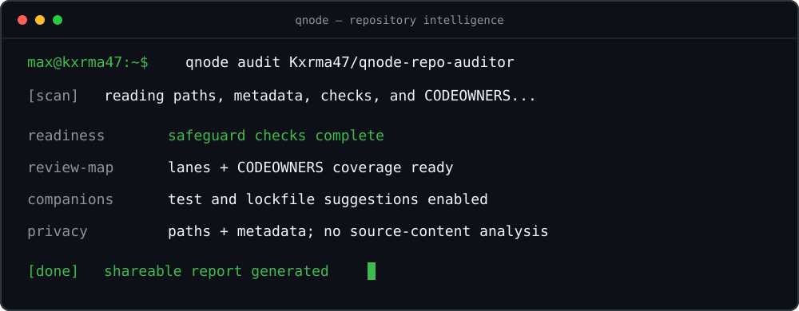

<div align="center">



[](https://orcid.org/0009-0008-3537-3794)
[](https://doi.org/10.1109/DCHPC69296.2026.11517248)
[](https://www.scopus.com/authid/detail.uri?authorId=60688133900)

</div>

I build tested, reproducible systems for research and engineering—from
phylogenetic software and evolutionary-optimization experiments to host anomaly
detection and GitHub repository intelligence.

## `$ tree ~/selected-work`

```text
selected-work/
├── qnode/          [DEPLOYED]  repository and pull-request intelligence
├── aspartik/       [UPSTREAM]  phylogenetic research software
├── bdsky/          [RESEARCH]  phylogenetic tree-prior evaluation
└── hostwatch/      [PROTOTYPE] privacy-aware host anomaly detection
```

### `[DEPLOYED]` [QNode Repository Auditor](https://github.com/Kxrma47/qnode-repo-auditor)

GitHub App for repository readiness, pull-request risk, companion-test
suggestions, CODEOWNERS coverage, review maps, GitHub Checks, and shareable
reports. [Run the live scanner](https://qnode-repo-auditor.onrender.com).

[](https://www.bestpractices.dev/projects/14715)



### `[UPSTREAM]` [Aspartik contributions](https://github.com/kaathewisegit/aspartik/pulls?q=is%3Apr+author%3AKxrma47)

Rust and Python contributions covering phylogenetic tree models, distance
algorithms, Python bindings, NEXUS/Newick parsing, SVG rendering, fixtures,
tests, and benchmarks.

### `[RESEARCH]` [BDSKY Tree Prior Evaluator](https://github.com/Kxrma47/BDSKY-Tree-Prior-Evaluator)

Python implementation of a Birth-Death Skyline tree-prior likelihood with
piecewise-constant rates, sampled-tree event modeling, and unit tests.

### `[PROTOTYPE]` [ML Host Anomaly Detection](https://github.com/Kxrma47/ml-host-anomaly-detection)

Privacy-aware UEBA prototype using host telemetry, event-derived features,
autoencoder scoring, calibrated rules, chronological evaluation, and structured
reports.

## `$ tail -n 5 ~/activity.log`

<!-- RECENT-ACTIVITY:START -->

```text
[OPEN  ] kaathewisegit/aspartik #51  Avoid redundant RF clade hashing
[OPEN  ] kaathewisegit/aspartik #50  Reduce triplet pruning state traffic
[OPEN  ] github/advisory-database #9476  [GHSA-hf57-cqmx-p4gr] OmniRoute ACP Custom-Agent Remote...
[OPEN  ] github/advisory-database #9475  [GHSA-vwc7-r8mq-g2x9] adm-zip extraction follows destin...
[OPEN  ] github/advisory-database #9474  [GHSA-2q42-4q24-7rgv] OpenAPI3 version value escapes `e...
```

<!-- RECENT-ACTIVITY:END -->

## `$ cat ./research-output`

### `[PUBLISHED]` Quantum Gantt Charts for Spatial Data Engineering

IEEE DCHPC 2026 conference paper on visualizing spatial-data workflows and
quantum-inspired candidate stages.

[DOI](https://doi.org/10.1109/DCHPC69296.2026.11517248) ·
[IEEE Xplore](https://ieeexplore.ieee.org/document/11517248) ·
[Scopus](https://www.scopus.com/authid/detail.uri?authorId=60688133900) ·
[NASA ADS](https://ui.adsabs.harvard.edu/abs/2026dchp.conf17248M/abstract)

Indexed in **Scopus** and the **NASA Astrophysics Data System (NASA ADS)**.

### `[RELEASED]` Defense Scheduler System

Role-based academic scheduling software with defense windows, polling, voting,
authentication, notes, and data export.

[Repository](https://github.com/Kxrma47/Defense-Scheduler-System) ·
[Zenodo release](https://doi.org/10.5281/zenodo.17427199)

<details>
<summary><code>$ ls ./more-systems</code></summary>
<br>

- **[Moodle Poll Plugin](https://github.com/Kxrma47/Plugin-For-Moodle)** — academic voting and scheduling with RBAC, CSRF protection, i18n, statistics, and Excel export.
- **[RNA-seq Analysis](https://github.com/Kxrma47/RNA-seq-Analysis-of-Flor-Yeast-Development-in-Saccharomyces-cerevisiae)** — reproducible Snakemake, HISAT2, featureCounts, MultiQC, and DESeq2 workflow.
- **[SolidJS bModel Visualizer](https://github.com/Kxrma47/SolidJS-Prototype-for-Visualizing-Model-Support-and-Relationships-Generalized-bModelTest-)** — interactive D3 visualization for phylogenetic model support.

</details>

## `$ env | sort`

```text
LANGUAGES="Python Rust TypeScript SQL JavaScript C++"
RESEARCH="PyTorch scikit-learn Qiskit DESeq2 DADA2"
SYSTEMS="PostgreSQL Flask Docker RabbitMQ GitHub-Actions"
VISUALS="React SolidJS D3.js"
```

## `$ ./github-signal --summary`

<div align="center">
  
  
</div>

## `$ ./contribution-snake --watch`

<picture>
  <source media="(prefers-color-scheme: dark)" srcset="https://raw.githubusercontent.com/Kxrma47/Kxrma47/output/contribution-snake-terminal-dark.svg" />
  <source media="(prefers-color-scheme: light)" srcset="https://raw.githubusercontent.com/Kxrma47/Kxrma47/output/contribution-snake-terminal.svg" />
  
</picture>

## `$ ping --contact`

```text
target   research software · machine-learning engineering · open source
status   available for collaboration
email    mhaque@edu.hse.ru
```
