<div align="center">

[](https://www.hse.ru/org/persons/1156238559/)
[](https://orcid.org/0009-0008-3537-3794)
[](https://doi.org/10.1109/DCHPC69296.2026.11517248)
[](https://doi.org/10.5281/zenodo.17427199)


</div>

<a href="https://kxrma47.github.io/Kxrma47/"></a>

<div align="center">
  <a href="https://kxrma47.github.io/Kxrma47/"><code>ENTER INTERACTIVE COMPANION LAB ↗</code></a>
</div>


Software engineering graduate and **Research Intern at HSE University** in Moscow, building research-grade tools across quantum computing, machine learning, scientific visualization, data analysis, and full-stack systems.

```toml
[operator]
handle = "Kxrma47"
role = "Research Intern @ HSE"

[domains]
primary = ["quantum computing", "ML engineering"]
systems = ["full-stack", "data pipelines", "scientific visualization"]

[principles]
engineering = ["tested", "reproducible", "measurable"]
```

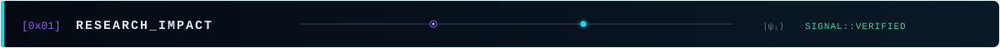

- Published **IEEE DCHPC 2026** work on [Quantum Gantt Charts for Spatial Data Engineering](https://doi.org/10.1109/DCHPC69296.2026.11517248).
- Built a constrained-optimization benchmark spanning **39 CEOP formulations**, **14 optimizers**, and **37 validation tests**, with parallel trials on Yandex DataSphere.
- Developed a host anomaly-detection pipeline trained on **1,439 telemetry samples**; its demo detected **26/26 injected anomalies** with 3 false positives.
- Released the [Defense Scheduler System v1.0.0](https://doi.org/10.5281/zenodo.17427199) as citable open software on Zenodo.
- Earned an **Open Doors Winner Diploma** in Computer Science & Data Science and a **High Achievements Diploma** in Applied Mathematics & AI.

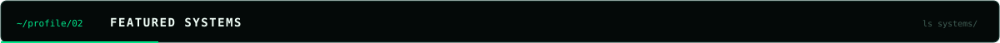

<div align="center">
  <a href="https://github.com/Kxrma47/ml-host-anomaly-detection">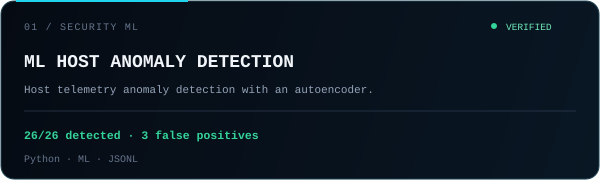</a>
  <a href="https://github.com/Kxrma47/Plugin-For-Moodle">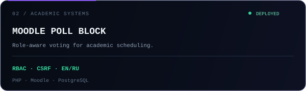</a>
  <a href="https://github.com/Kxrma47/Defense-Scheduler-System">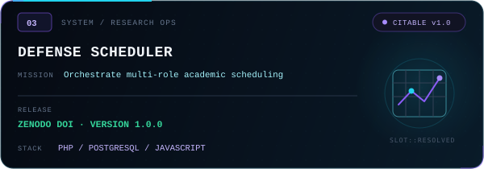</a>
  <a href="https://github.com/Kxrma47/SolidJS-Prototype-for-Visualizing-Model-Support-and-Relationships-Generalized-bModelTest-">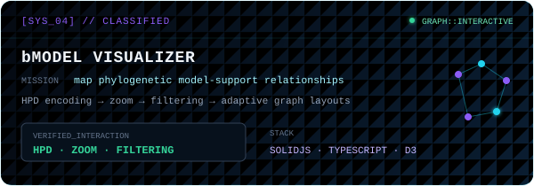</a>
</div>

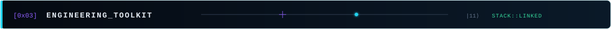

<div align="center">
  
</div>

| Research & ML | Full-stack & data | Engineering |
|---|---|---|
| Qiskit · PyTorch · scikit-learn · SciPy · statsmodels | React · SolidJS · D3 · Flask · Moodle · SQLAlchemy | PostgreSQL · SQLite · Docker · Playwright · Vitest |
| Quantum search · optimization · anomaly detection | REST APIs · RBAC · scientific visualization | Git · shell scripting · Java · Kotlin · C++ |

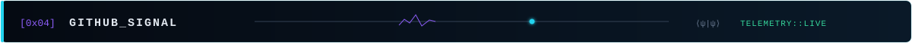

<div align="center">
  
  
  
</div>


<picture>
  <source media="(prefers-color-scheme: dark)" srcset="https://raw.githubusercontent.com/Kxrma47/Kxrma47/output/github-contribution-grid-snake-dark.svg" />
  <source media="(prefers-color-scheme: light)" srcset="https://raw.githubusercontent.com/Kxrma47/Kxrma47/output/github-contribution-grid-snake.svg" />
  
</picture>

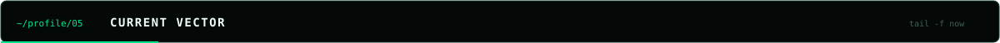

- **Research Intern**, HSE Faculty of Computer Science / AI and Digital Sciences - 2026-present
- **Research Assistant**, Swarm Intelligence & Evolutionary Optimization - 2024-present
- **B.Sc. Software Engineering**, HSE University - 2026
- **Incoming M.Sc. Cognitive Sciences and Technologies**, HSE University - 2026-2028

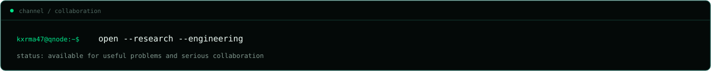
